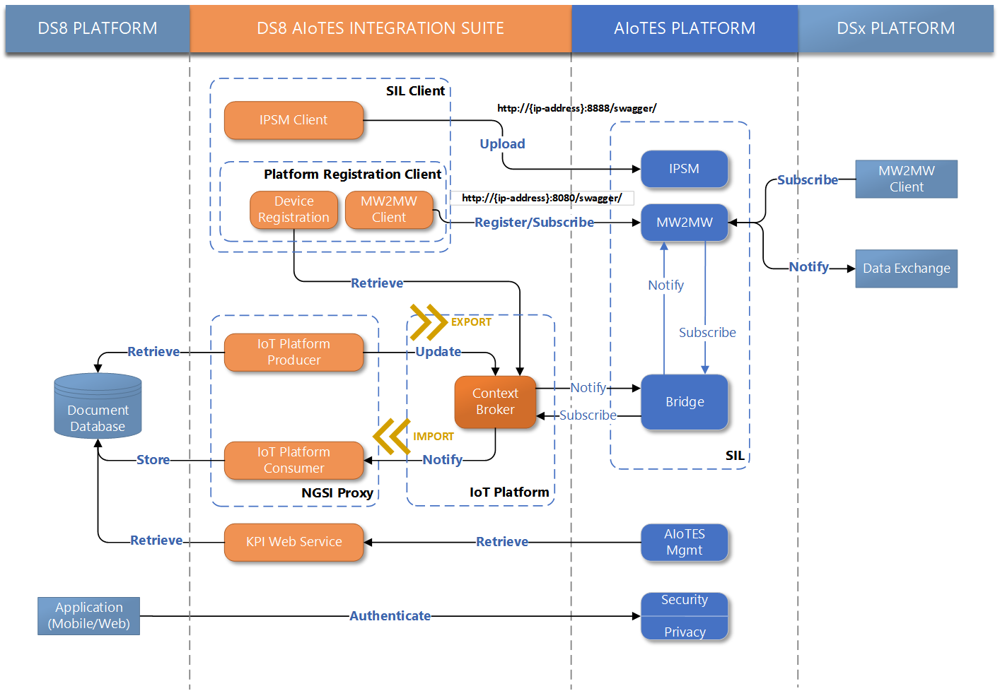
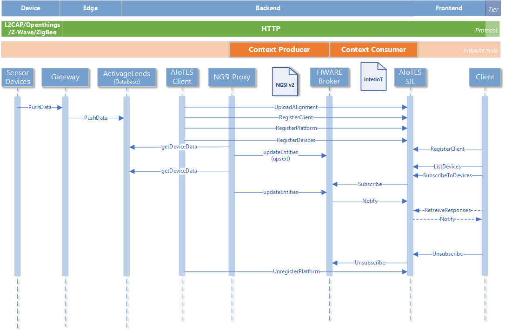

# ACTIVAGE AIoTES Integration Suite  

## Introduction  
The [ACTIVAGE](http://www.activageproject.eu/) [Leeds](http://www.activageproject.eu/deployment-sites/Leeds/) AIoTES Integration Suite enables the integration of the ActivageLeeds platform with the ACTIVAGE IoT Ecosystem Suite (AIoTES) Semantic Interoperability Layer (SIL). The Integration Suite consists of the following modules:

- `SIL Client`: handles semantic mapping uploading and device registration  
- `IoT Platform`: A legacy platform compatible with AIoTES which enables the exchange of IoT Data between a Deployment Site (DS) and SIL via the IoT platform bridge. The platform selected is FIWARE.
- `NGSI proxy`: A module for enabling a proprietary platform API to exchange context data with a FIWARE Generic Enabler.
- `IoT KPI Web Service`: A web service providing technical KPI values regarding the DS platform.  

It pulls data from services provided by the ActivageLeeds Platform and publishes to an IoT platform compatible with the ACTIVAGE AIoTES Framework. The IoT platform used is FIWARE.

## Architecture  

  

## Interactions  

## Installation Guide

### System Requirements  

#### Software Dependencies  
The following dependencies are required to run the software:   

- OpenJDK 8  
- Maven 3.1+ (for compiling and generating the executable)
- MongoDB 3.2+   

#### Interfacing System Entities  
The software interacts with the following components in the Activage Leeds Platform:

- ActivageLeeds Document Database  (MongoDB)
- ActivageLeeds Web Server  (SmartThings API)
- Orion Context Broker  (IoT Platform)  
- SIL FIWARE bridge  
- IoT Platform Semantic Mediator (IPSM)  
- Inter Middleware Message Broker (INTER-MW)  

