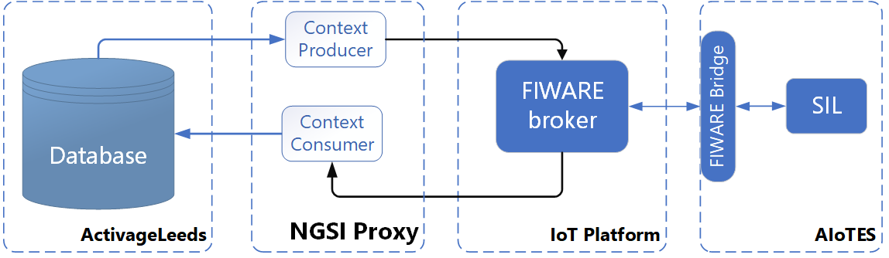

# ACTIVAGE Leeds IoT Platform Producer  

## Introduction  
The IoT Platform Data Producer is a component as part of the ACTIVAGE Leeds AIoTES Integration Suite. It pulls data from services provided by the Activage Leeds Platform and publishes to an IoT platform compatible with the ACTIVAGE AIoTES Framework. The IoT platform used is FIWARE.

## Architecture  

  

## Installation Guide

### System Requirements  

#### Software Dependencies  
The following dependencies are required to run the software:   

- OpenJDK 8  
- Maven 3.1+ (for compiling and generating the executable)
- MongoDB 3.2+   

#### Required Software Libraries  

- `junit:junit:jar:4.12:test`  
- `org.hamcrest:hamcrest-core:jar:1.3:test`  
- `log4j:log4j:jar:1.2.17:compile`  
- `com.fasterxml.jackson.core:jackson-core:jar:2.10.1:compile`  
- `com.fasterxml.jackson.core:jackson-databind:jar:2.10.1:compile`
- `com.fasterxml.jackson.core:jackson-annotations:jar:2.10.1:compile`
- `org.hashids:hashids:jar:1.0.3:compile`
- `org.restlet.jee:org.restlet:jar:2.3.9:compile`
- `commons-io:commons-io:jar:2.6:test`
- `org.mongodb:mongo-java-driver:jar:3.11.2:compile`
- `javax.validation:validation-api:jar:2.0.1.Final:compile`
- `commons-cli:commons-cli:jar:1.4:compile`
- `javax.ws.rs:javax.ws.rs-api:jar:2.1.1:compile`
- `org.glassfish.jersey.core:jersey-common:jar:2.29:compile`
- `jakarta.ws.rs:jakarta.ws.rs-api:jar:2.1.5:compile`
- `jakarta.annotation:jakarta.annotation-api:jar:1.3.4:compile`
- `org.glassfish.hk2.external:jakarta.inject:jar:2.5.0:compile`
- `org.glassfish.hk2:osgi-resource-locator:jar:1.0.3:compile`

#### Interfacing System Entities  
The software interacts with the following components in the Activage Leeds Platform:

- ActivageLeeds Document Database  (MongoDB)
- ActivageLeeds Web Server  (Main Node server)
- Orion Context Broker  (IoT Platform)  

### System Installation  

#### Configure  
The producer requires configuration details relating to the data sources and the data broker to publish to.  
The configuration file `config.properties` in the `resources/config` source folder is used to point to configuration files outside of the source directory. These files are:  
- `database.properties`: contains fields relating to accessing the document database.  
- `api.properties`: contains fields relating to reaching web services for the ActivageLeeds API and the FIWARE NGSI broker.  

The root location for these configuration files have been set to `/etc` for Linux systems, and `%LOCALAPPDATA%` directory for Windows. From the root location, the path can be specified e.g.:  

```/activage/aiotes/iot-platform-proxy/activage_leeds_db.properties```  
##### Configuration properties  

 - Database properties (values are examples):  

```shell script
#  db.properties

activageleeds.mongodb.hostname = localhost
activageleeds.mongodb.port = 27017
activageleeds.mongodb.username = admin
activageleeds.mongodb.password = admin
activageleeds.mongodb.db.admin = admin
```

 - API properties:  
```shell script
#  api.properties

# CLIENT CONNECTION SETTINGS
client.socket.timeout   = 120000

# NGSI API
url.host.broker.orion = http://localhost:1026
url.path.broker.batch_update_op.entity = /v2/op/update

#ACTIVAGELEEDS API
url.host.broker.smartthings = {url}
```

#### Compile      
Compile using command below:

``` mvn clean compile assembly:single``` 

#### Run   
After compiling, target the executable jar file in the ```/target``` folder, and run the command:  

```java -jar activage-leeds-fiware-producer.jar```

The response should be as follows:  

```text  
Parsing failed.  Reason: Missing required options: d, i, u
usage: proxy
 -d,--deviceGroup <arg>   the device group to pull from; can be either
                          "home", "wearable", "adl", or "notification"
 -i,--interval <arg>      the interval time between polls in seconds
 -u,--uuid <arg>          the user uuid. Enter "all" for polling all users
```  
  
The executable expects parameters relating to:  
  
- `deviceGroup`: the device group relates to how device data has been grouped, based on the typical . can be either `home`, `wearable`, `adl`, or `notification`.
- `interval`: the producer pulls data periodically based on the value set here, in seconds.  
- `uuid`: enter the uuid of the user to retrieve all associated device data. If all users are required, then `all` should be entered.

So when executing the application from the terminal, the command would be for example:  

```text
java -jar activage-leeds-fiware-producer.jar -d home -i 5 -u all  
```  

To run java process in background:  

``` nohup java -jar test.jar & ```

#### Terminate  
Find java process using the `jps` tool that comes with the Java JRE
  - ```jps -l```  
 
 ```text  
$ jps -l
42464 sun.tools.jps.Jps
9004 activage-leeds-fiware-producer-1.0.jar

``` 
Kill java process:
  
 - Linux: ```kill -9 {PID}```  
 - Windows: ```Taskkill /PID {PID} /F ```  
   
## How it works  

The IoT producer pulls device data periodically from 2 sources in the ActivageLeeds platform:  

 - Document database   
 - API  

### Database  
Data is pulled from the following database collections:  
 
 - `users`: user information  
 - `energenieuserconfigs`: Device information associated with users
 - `energystatesstorages`: Data from Energenie devices relating to Motion, Door and Energy sensors.  
 - `shealthaggregateddatas`: Data from Samsung Health devices; relating to Pedometers, Heart Rate and Sleep sensors.  
 
 The producer pulls device data from the database collections in the following manner:  

1. Retrieve consenting users    
    
    ```    
    from users:
        if agreement.personalData && agreement.participation == true
            read user;
    ```    
    
2. Retrieve devices associated with each user    
    
    ```text      
    from energenieuserconfigs:
    for user : users
        read (mac, gearSerialNumber, electricalMonitorId, devices, phoneIMEI);
    ```    
3. Retrieve data from associated devices

- Retrieve data from (Energenie) home sensor devices: 
```
for user : users
    from energystatesstorages:
        for device:            
            read value;
            read ts;
```  
- Retrieve data from (Samsung Health) personal health devices: 
```  
    from shealthaggregateddatas:
        for type [{heartRate, sleep, sleepStage, stepCount}]
            read value;
            read ts;
```  
### API  
For data from SmartThings devices, the ActivageLeeds API is called in using the following HTTP request, after all `uuid`'s for consenting users are retrieved from the database.

```text
GET /api/smartthings/{uuid}/devices/list HTTP/1.1
Host: activageleeds.co.uk
cache-control: no-cache
```  
...where `{uuid}` corresponds to the user ID.

It then models the devices using the corresponding NGSI data models as defined [here](docs/models/activage-aiotes-ds8-data-models.md).   