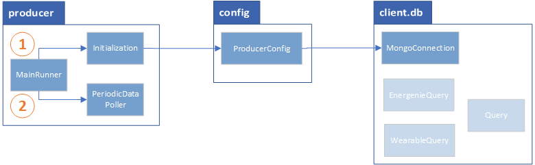
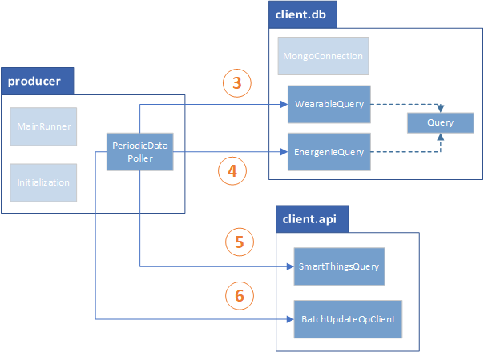
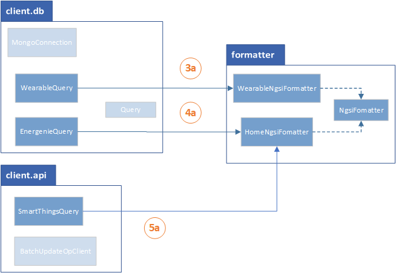

# ACTIVAGE Leeds FIWARE Producer Technical Document  

# Introduction  

This document explains on how the source code is structured and how the classes interact with each other.
ap
# Packages  

The source contains the following packages:  

- *producer*: contains processes that handle starting the producer, initialisation, and the periodic poller.  
- *config*: contains processes that  handles the loading of configuration parameters
- *client.db*: contains processes that handle database access.  
- *client.api* contains processes that interact with remote services via their API.  
- *formatter*: contains processes that format the data retrieved from the database to that is NGSIv2 compatible.  

## Initialisation    

## Main  

## Formatting
